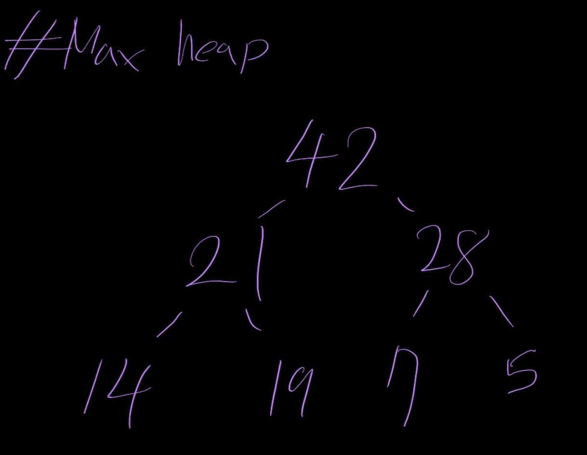
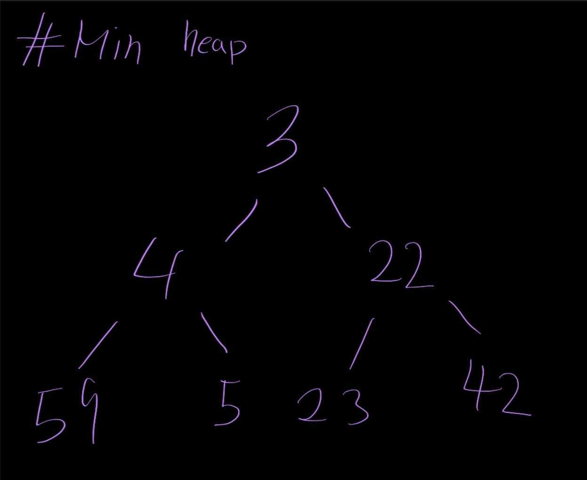
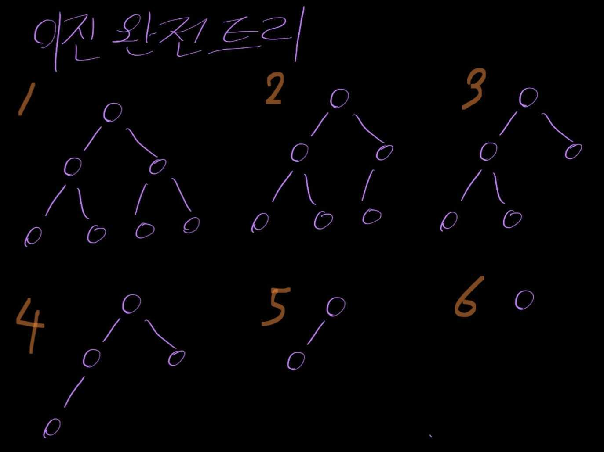
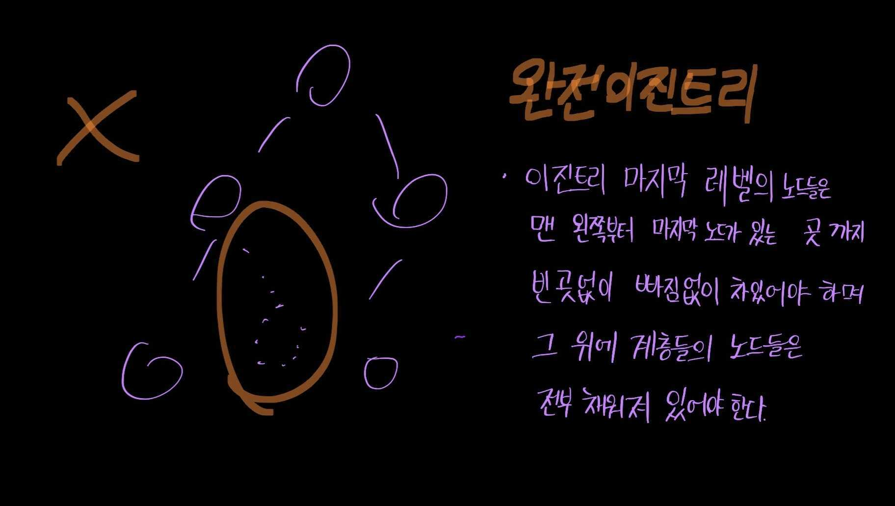

# Heap

## Heap이란?

heap의 뜻은 산더미, 모래더미 등과 같은 더미를 의미한다.

자료구조에서의 힙도 더미이지만 조금 다른 모습을 보인다.
데이터들을 크기에 따라 어떻게 구성하는지에 따라 Max heap, min heap 두 가지로 나뉜다.

Max heap은 부모노드가 자식노드보다 큰 완전이진트리를 말한다.

Min heap은 부모노드가 자식노드보다 작은 완전이진트리이다.

이진트리는 자식노드의 개수가 최대 2개인 형태의 트리이다.
완전이진트리는 트리 마지막 계층에 있는 노드들은 맨 왼쪽부터 마지막 노드가 있는 곳까지 빈 곳 없이 채워져 있는 이진트리이다.
중간에 비어있는 부분이 있다면 완전이진트리가 아니다.

힙의 이러한 특성을 이용해서 root에 있는 값을 pop해서 정렬할 수 있다.

## 구현

힙의 구현은 이진트리와 배열 둘 다를 이용할 수 있다.
보통 배열을 이용하여 구한다.

### 힙 배열 구현

0번 인덱스는 비워둔다.
1번 인덱스부터 값을 채운다.
1번 인덱스에 루트를 위치시킨다.
자식 노드의 위치는 왼쪽 자식의 경우 현재 노드 _ 2, 오른쪽 자식의 경우 현재 노드 _ 2 + 1 인덱스이다.
부모노드의 경우 현재 노드 / 2한 값의 정수부를 인덱스로 하면 된다.
